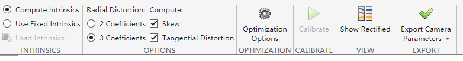
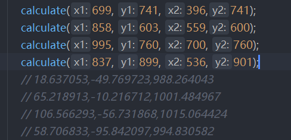

# 采集图片
是用的海康的例程来拍摄的，首先要设置好以太网的IP地址
1. 在下面的工控机上用命令行打开，输入ipconfig，找到网卡的IP地址，然后在自己的电脑设置好以太网端口的ipv4地址，xxx.xxx.xxx.xxx第四个不要一样2-255随便取，可能会取到和相机一样的，那就再换一个
2. 用海康的example下面的python脚本中的multicamera.py
3. 打开相机后先start获取一下画面看一下，太暗的话就调整一下曝光度，单位是us，默认是20000us，我改成了100000us还是多少，忘了，要看当时的光照情况怎么样，调的稍微亮一点
4. （曝光时间调高了对实际使用不好，实际帧率会降低，但是不影响标定，后期最好还是和一代机一样有补光灯带）
5. 摆放棋盘格标定盘，多拍一些图片，分放在两个文件夹里，不要全都是平方在传送带上，不然深度信息会有问题
# MATLAB工具使用
6. 在matlab app中找到stereocalibration，运行，加载图片先放左相机的，再放右相机的，棋盘格参数设置变长为20，后面的选项对应下图点击calibrate

7. matlab标定结果中的内参矩阵和旋转矩阵需要转置，并且注意畸变参数的顺序
# 测试一下数据
8. 然后拿下面的蓝色小方块，拍了一下，用来测试，蓝色小方块我用手机量的62mm-63mm
9. 在main.cpp中根据标定参数，计算方块的四个角点的位置，计算边长在63mm左右
10. main中先注释
11. 在可执行文件夹会生成right和left图片，输入坐标后再取消注释
12. 

import numpy as np

point1 = np.array([18.637053,-49.769723,988.264043])
point2 = np.array([65.218913,-10.216712,1001.484967])

计算两点之间的欧几里得距离

distance = np.linalg.norm(point1 - point2)

print(distance)//得到62.52282136659778接近小蓝色方块变长
